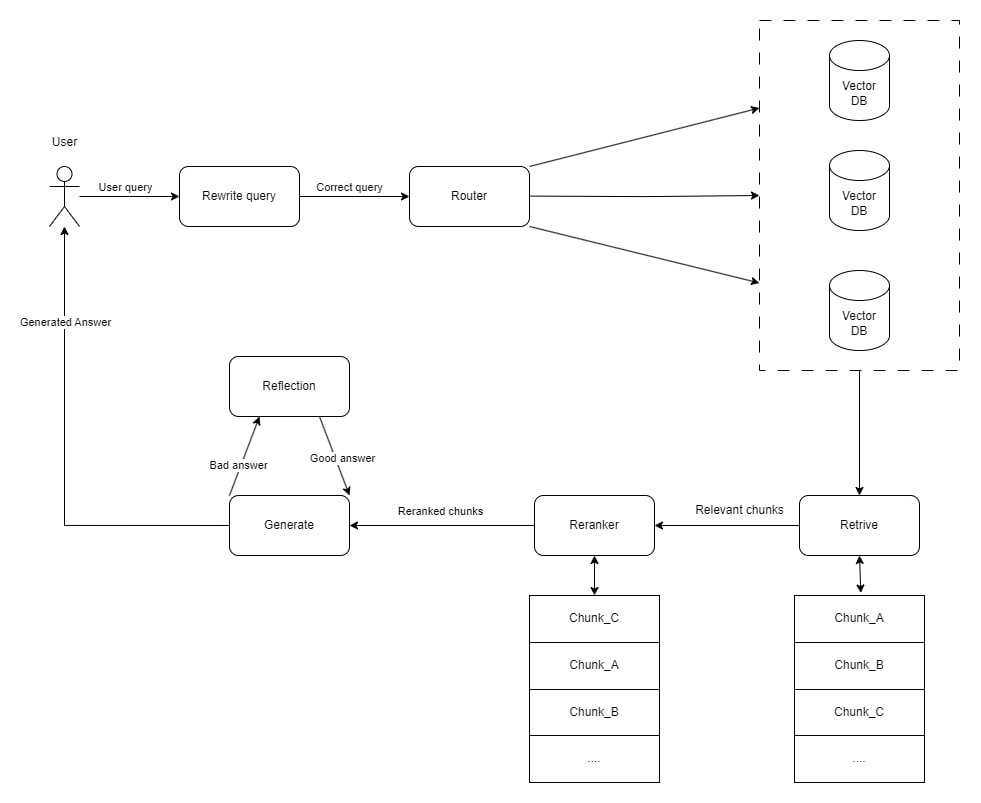
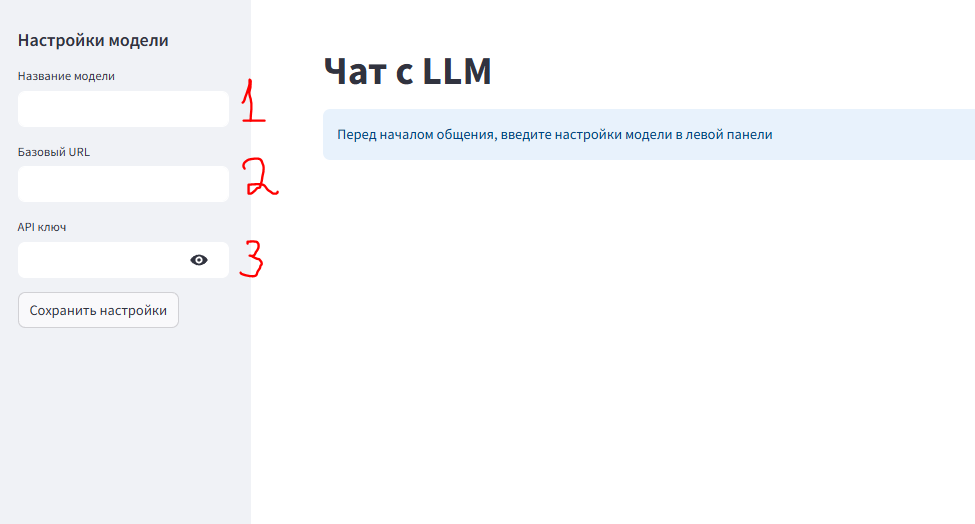
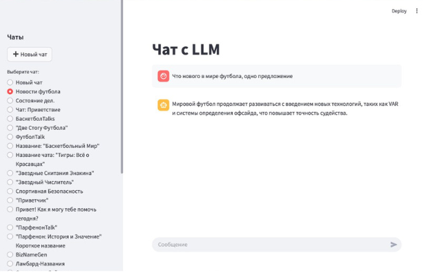

# Мульти-чат с LLM (LangChain + LangGraph + PostgreSQL)

Данный проект представляет собой веб-приложение на базе **Streamlit**, которое позволяет:
- Общаться с большой языковой моделью (LLM) в режиме чата.
- Создавать и хранить несколько чатов в базе данных **PostgreSQL**.
- Управлять «температурой» модели.
- Легко настраивать подключение к локальной или удалённой LLM (например, OpenAI).

---
## Основные возможности

1. **Несколько чатов**: Создавайте новые чаты, переименовывайте и переключайтесь между ними.
2. **История сообщений**: Хранится в PostgreSQL, поэтому при перезапуске приложения контекст не теряется.
3. **Гибкая настройка модели**: название модели, URL и API-ключ.
4. **Streamlit-интерфейс**: Удобный веб-приложение, не требующее дополнительной фронтенд-разработки.
5. **RAG с Router агентом и поиском по векторной базе (ниже будет представлена схема)**
6. **Поиск по своим (загруженным) файлам**: Загружайте свои файлы в формате PDF, txt и используйте их в своей работе.

---
# Схема работы RAG




---
# Как настроить чат



1. **Название модели** — введите LLM, с которой планируете работать (в данном случае `llama-3-8b-instruct-8k`).
2. **Базовый URL** — напишите URL модели, например: `https://api.openai.com/v1/chat/completions`.
3. **API ключ** — вставьте ваш секретный ключ (не передавайте его никому!).
4. Нажмите на кнопку **«Сохранить настройки»** — и можно начинать общение в чате. 
5. **Первый запуск модели** - Время загрузки векторной модели при первом запуске может достигать 20 минут.
   

Введя эти данные, они будут передаваться в [init_chat_model](https://python.langchain.com/api_reference/langchain/chat_models/langchain.chat_models.base.init_chat_model.html)
соотвественно: model, model_provider, base_url, api_key.

---
## Модель работы в чате



1. В левой боковой панели выберите или создайте новый чат.
2. В главном окне введите сообщение и нажмите Enter.
3. Модель сгенерирует ответ, учитывая предыдущий контекст диалога.
4. Все сообщения сохраняются в базе данных, чтобы вы могли вернуться к ним позже.

---
## Установка и запуск

### 1. Локальный запуск (без Docker)

1. Клонируйте репозиторий:
   ```bash
   git clone https://github.com/username/ai-bootcamp.git
   cd ai-bootcamp/app


2. **Установите зависимости**:
   ```bash
   pip install -r requirements.txt
   ```

3. **Настройте PostgreSQL**:
   - Запустите PostgreSQL локально или настройте подключение к удалённой базе данных.
   - Убедитесь, что в файле .env параметры подключения к Postgres (`DB_NAME`, `DB_USER`, `DB_PASSWORD`, `DB_HOST`, `DB_PORT`) настроены корректно.

4. **Запустите Streamlit**:
   ```bash
   streamlit run main.py
   ```

5. **Откройте приложение**:
   - Перейдите по адресу `http://localhost:8501` в браузере.

---

### 2. Запуск через Docker Compose

1. **Убедитесь, что у вас установлены Docker и Docker Compose**:
   - Если Docker не установлен, следуйте официальной документации: [Docker Installation](https://docs.docker.com/get-docker/).

2. **Запустите приложение**:
   - Зайдите в папку app (где находится `docker-compose.yml`) выполните:
     ```bash
     docker-compose up --build
     ```

3. **После сборки и запуска контейнера откройте приложение**:
   - Перейдите по адресу `http://localhost:8501` в браузере.
   
   **Примечание**: 
   - При первом запуске Docker может потребоваться время на загрузку
   образов и установку зависимостей. Дождитесь появления сообщения о том, 
   что приложение запущено, прежде чем переходить по адресу `http://localhost:8501`.
   
4. **Остановка приложения**:
   - Для остановки выполните:
     ```bash
     docker-compose down
     ```
---

## Тестирование

В файле notebooks/test_evaluate.ipynb приведены метрики по оценки RAG при помощи RAGAS

## Переменные окружения

Приложение использует переменные окружения (через `.env` или иными способами):

- **Для подключения к PostgreSQL**:
  - `DB_NAME` — имя базы данных.
  - `DB_USER` — пользователь базы данных.
  - `DB_PASSWORD` — пароль пользователя.
  - `DB_HOST` — хост базы данных.
  - `DB_PORT` — порт базы данных.

- **Параметры RAG**:
  - `ARTIFACTS_PATH` - путь к папке со всеми артифактами
  - `ROUTER_CONFIG_PATH` - конфигурация роутера
  - `EMBEDDING_MODEL_NAME` - название модели для эмбеддингов ("all-mpnet-base-v2")
  - `CLASSES_JSON_INFO_PATH` - конфигурационный файл для работы с поисковиком и датасетом
  - `DATAFRAME_PATH` - путь на датасет с вопросами и ответами
  - `INDEX_ROUTER_PATH` - путь на индекс роутера
- 
- **Параметры API**:
  - `PROVIDER_API` - провайдер вашего API (для LangChain)

---
## Возможные проблемы и решения

1. **Не удаётся подключиться к БД**:
   - Проверьте настройки в `.env`.
   - Убедитесь, что PostgreSQL запущен и доступен.

2. **LLM не отвечает**:
   - Проверьте, что указаны правильные `API_KEY`, `API_URL` и `MODEL_PROVIDER`.
   - Убедитесь, что API-ключ активен и имеет доступ к модели.

3. **Ошибка Docker**:
   - Проверьте, что файлы `Dockerfile` и `docker-compose.yml` корректны.
   - Убедитесь, что Docker и Docker Compose установлены правильно.

4. **Порт занят**:
   - Измените порт в `docker-compose.yml` на свободный.
   - Или освободите занятый порт, завершив процесс, который его использует.
---
## Проект разработали

 - Максим. Telegram: @maks_maks1
 - Глеб. Telegram: @glebsolyanik
 - Елена. Telegram: @Elena_PromptLab


